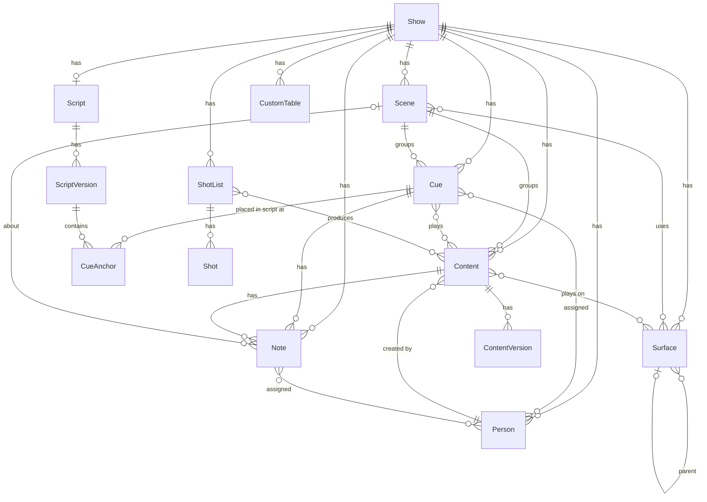

# Data model

A fixed **core** of tables that the app understands (cues, notes, content, scenes, surfaces,
script, shots, people), plus **custom fields** on any core table and **custom tables** for
everything else. The core is what lets the app do cue-specific things (group by scene, show
notes on a cue, anchor cues in the script, compute PPI). Custom fields and tables give the
Airtable-style flexibility for the rest.

Derived from the *Some Like It Hot* base in `examples/` and the team's answers. Field lists
are a starting point; everything is open to change.

## Conventions

Every core record has:

| Field | Notes |
| --- | --- |
| `id` | Stable, never reused |
| `show_id` | Everything belongs to exactly one show |
| `created_by`, `created_at`, `updated_by`, `updated_at` | Maintained automatically |
| `order_key` | On ordered tables (Scene, Cue, Content, Shot). A fractional-index string that defines manual "show order". See [ux.md](ux.md#ordering-and-sorting). |
| custom fields | Any table can have user-added fields (see [Field types](#field-types)) |
| change history | Every field change is logged: who, when, old, new |

Names in `snake_case` below are storage names; the UI shows friendly labels.

## Entity diagram

## Core tables

### Show

One per production. All other records belong to a show.

| Field | Type | Notes |
| --- | --- | --- |
| `name` | text | "Some Like It Hot" |
| `venue` | text | "Olney Theatre Center" |
| `status` | select | Prep / Rehearsal / Tech / Running / Closed / Archived |
| `default_unit` | select | m, cm, mm, ft-in, ft, in: default display unit for measurement fields. Kept in the ShowDO `meta` row (the `meta` op), not D1 |
| `default_frame_rate` | number | for timecode fields |
| `dates` | date range | first rehearsal, first preview, opening, closing (from Calendar) |

Shows can be **cloned as a template**: scenes, surfaces, custom tables and view definitions
copy; cues, notes and content don't.

### Scene

From the *Breakdown* table. The unit the show is organized around; cues and content belong
to a scene, and the cue list groups by it.

| Field | Type | Notes |
| --- | --- | --- |
| `number` | text | "101", "202". Used for sorting suggestions and content naming |
| `name` | text | "Scene One: Hottest Speakeasy in Chicago" |
| `act` | select | Act 1 / Act 2 / Preshow / Intermission… optional grouping above scene |
| `location` | text | |
| `time_of_day` | text | |
| `song` | text | "No. 2 - WHAT ARE YOU THIRSTY FOR" |
| `stage_direction` | long text | top-of-scene stage direction |
| `description` | long text | |
| `video_overview` | long text | the design intent for the scene |
| `surfaces` | link → Surface (many) | which surfaces are in play |
| `order_key` | order | show order |
| computed | | cue count, content count, open note count |

### Cue

From the *Cue List* table. The heart of the tool.

| Field | Type | Notes |
| --- | --- | --- |
| `number` | text, optional | "0.10", "14.25", "8.5A". Text, not a number: leading zeros, letters and multi-dot forms must survive. Validated against a configurable pattern; duplicates warn but don't block |
| `scene` | link → Scene | required for grouping; a cue with no scene shows in an "Unassigned" group |
| `description` | text | what happens visually ("skyline silhouette early morning") |
| `trigger_type` | select | Line / LX / SQ / Timecode / Visual / Follow / Manual |
| `trigger_value` | text | the line, LX/SQ number, timecode, or description of the visual |
| `sm_call` | long text | what the SM says or sees ("CLICK A - JOE: 'Sweet Sue needs a sax…'"). Often the same as a Line trigger; kept separate because it can be longer and include context |
| `lx_cue` | text | linked LX cue number, when the video cue is taken with lights |
| `sq_cue` | text | linked sound cue |
| `timecode` | timecode | show timecode the cue fires on, if timecoded |
| `ae_time` | timecode | position in the After Effects comp (per cue, since content plays across cues) |
| `measure` | text | bar number in the score ("MSR") |
| `page` | text | script page. Kept as its own field, but updated automatically from the script anchor when one exists |
| `status` | select | Not started / In process / Rendered / Cued (the four values in the data) — editable list |
| `assignees` | link → Person (many) | |
| `content` | link → Content (many) | what plays in this cue |
| `is_section` | checkbox | a header row ("ACT 2", "INTERMISSION") that shows as a divider, not a cue |
| `order_key` | order | show order |
| computed | | open notes count, current content version(s), anchor state in latest script |

`sm_call`, `lx_cue`, `sq_cue`, `timecode` all stay as fields because a cue can have a line
call *and* an LX number *and* a timecode; `trigger_type` says which one the operator actually
goes on, and is what the script view displays.

### Content

From the *Content* table. A piece of media that plays in one or more cues. Versions are
separate records (below).

| Field | Type | Notes |
| --- | --- | --- |
| `name` | text | "103-004-CANTHAVEME". The `SSS-NNN-NAME` convention is captured as a per-show naming pattern; the app suggests the scene prefix and next number |
| `scene` | link → Scene | |
| `description` | long text | |
| `creator` | link → Person | who's building it |
| `status` | select | Not started / In process / Rendered / Delivered / Cut — editable |
| `surfaces` | link → Surface (many) | where it plays |
| `loop_in`, `loop_out` | timecode | loop points |
| `duration` | duration | from the current version, or entered |
| `resolution` | pixel size | w × h |
| `frame_rate` | number | |
| `thumbnail` | attachment | a still, shown in grid and pickers |
| `file_path` | text / URL | where the master lives (server path or Drive link). Cuesheet does not store the media |
| `cues` | link → Cue (many) | reverse of Cue.content |
| `order_key` | order | |
| computed | | current version, version count, open notes |

### ContentVersion

Replaces the single "Version" field. "V03 available", "New V02" notes in the example base
become version records.

| Field | Type | Notes |
| --- | --- | --- |
| `content` | link → Content | |
| `version` | text | "V03" — text so "V03a" works |
| `date` | datetime | |
| `rendered_by` | link → Person | |
| `changes` | long text | what changed from the previous version |
| `file_path` | text / URL | |
| `is_current` | checkbox | exactly one per content item; setting it clears the others |
| `status` | select | Rendering / Available / In Millumin / Superseded |

### Note

From the *Notes* table. The hub for tech notes. A note can be about a cue, a content item,
a scene, or the show in general, and any combination of those.

| Field | Type | Notes |
| --- | --- | --- |
| `body` | long text | the note |
| `type` | multi-select | Content / Programming / Director / Prod Mtg / Admin / Technical / Artistic / R&D / Stage Management — editable list |
| `priority` | select 1–5 | 1 = urgent |
| `status` | select | Open / In progress / Done. Replaces the two checkboxes in the base |
| `assignees` | link → Person (many) | |
| `cues` | link → Cue (many) | most notes link one cue; some span two ("8.20, 8.50") |
| `content` | link → Content | |
| `scene` | link → Scene | filled from the cue if not set |
| `session` | text / select | the rehearsal it came from: "Tech 3", "Preview 1". Defaults to the show's current session |
| `attachments` | attachment (many) | photos of the stage |
| `completed_by`, `completed_at` | auto | set when status becomes Done |
| `created_by`, `created_at` | auto | already in the base as "created by" / "Created Time" |

"Content Notes" on Cue and Content in the Airtable base were lookups/rollups of this table.
In Cuesheet they're just the notes panel filtered to that record.

### Surface

From the *Surfaces* table. A projection surface, LED wall, or a region of one, keyed to a
Millumin channel/layer.

| Field | Type | Notes |
| --- | --- | --- |
| `name` | text | "L PRO TOP" |
| `channel` | text | "CH02.1" |
| `parent` | link → Surface | CH02.1 and CH02.2 are regions of CH02. Stored as `parent_id`; no cycles |
| `width`, `height` | measurement | stored in meters, displayed in the show/view unit |
| `pixel_width`, `pixel_height` | number | |
| `ppi` | formula | `PPI(pixel_width, width)`: pixels per inch — built in |
| `pixel_pitch` | formula | `PITCH(width, pixel_width)`: mm per pixel, for LED |
| `aspect_ratio` | formula | of the pixel size, else the physical size ("16:9", "1.78:1") |
| `throw_distance`, `lens_ratio` | measurement / number | optional projector fields; `throw_width` (formula) = distance ÷ ratio |
| `images` | attachment (many) | set photos or renders with this surface's coverage marked; first image is the grid thumbnail |
| `description` | long text | |
| `scenes`, `content` | reverse links | |

### Script and ScriptVersion

One script per show, with versions as they arrive.

**Script**: `title`, `current_version` (link).

**ScriptVersion**:

| Field | Type | Notes |
| --- | --- | --- |
| `label` | text | "Rehearsal draft 9/12", "v4" |
| `source_file` | attachment | the PDF / DOCX as received; or a Google Doc URL |
| `imported_at` | datetime | |
| `text` | structured | extracted text, split into pages → blocks (paragraph / line / stage direction where detectable), each with a stable index |
| `page_labels` | map | printed page number per physical page ("14", "14a") |
| `stats` | computed | anchor counts by state after re-anchoring |

Only the extracted text and structure are stored for display; the original file is kept as
an attachment for reference and for print. Scanned PDFs are OCR'd on import and flagged as
lower-confidence.

### CueAnchor

Where a cue sits in a given script version.

| Field | Type | Notes |
| --- | --- | --- |
| `cue` | link → Cue | |
| `script_version` | link → ScriptVersion | |
| `page` | int | physical page index; `page_label` derived |
| `block_index`, `char_offset` | int | exact position in the extracted text |
| `quote` | text | the trigger text as it appeared ("Sweet Sue needs a sax and a bass") |
| `prefix`, `suffix` | text | ~32 characters of context either side |
| `state` | select | `matched` / `moved` / `changed` / `missing` / `manual` |
| `confidence` | number | from the re-anchoring match |

A cue placed on a Line trigger anchors to the selected text. A cue with an LX, timecode or
visual trigger anchors to a position (its `quote` is the nearest text, used only for
re-anchoring). When a new ScriptVersion is imported, every anchor from the previous version
is re-matched: exact quote+context → fuzzy quote → prefix/suffix only → nothing. The new
anchor's `state` records the result; old anchors are kept so any version can still be viewed.
See [ux.md](ux.md#script-view).

### ShotList and Shot

For video shoots. A shot list is a small ordered table with the same behaviors as the cue
list (manual order, grouping, printing).

**ShotList**: `name`, `shoot_date`, `location`, `content` (link → Content, many: what the
shoot produces), `notes`.

**Shot**:

| Field | Type | Notes |
| --- | --- | --- |
| `number` | text | "12", "12A" |
| `shot_list` | link → ShotList | |
| `group` | text / select | scene or setup, for grouping |
| `description` | long text | |
| `framing` | select | WS / MS / CU / … editable |
| `camera`, `lens` | text | |
| `resolution`, `frame_rate` | pixel size / number | |
| `talent` | link → Person (many) | |
| `duration` | duration | |
| `status` | select | Planned / Shot / Selected / Cut |
| `reference_image` | attachment | |
| `order_key` | order | |

### Person

From *Personnel*. Both the team and the people you need to reach.

| Field | Type | Notes |
| --- | --- | --- |
| `name` | text | |
| `role` | text | "Director", "Joe/Josephine" |
| `group` | select | Video team / Production / Creative / Cast / Crew |
| `email`, `phone` | text | |
| `organization` | text | "Olney Theatre Center" |
| `photo` | attachment | |
| `user` | link → User account | when this person logs in; gives them "my notes" |

### Custom tables

Anything else the team keeps in the show binder. From the example base:

| Table | Fields |
| --- | --- |
| Calendar | milestone, date, status, notes, attachments |
| Directory | name, link |
| Reference Links | name, URL, pinned, favorite |
| Network | name, IP, subnet, username, password, type |
| Millumin | shortcut, notes, toggle, assignee, status, attachments |

These are created by the user with the field types below and use the same grid, views and
formatting as core tables. Show templates can carry a starter set (Calendar, Directory,
Network are likely on every show). Password-type fields are masked in the grid.

## Field types

Available on core and custom tables.

| Type | Notes |
| --- | --- |
| text, long text | long text supports basic rich text and @mentions of people |
| number, percent, currency | |
| checkbox | |
| select, multi-select | options have colors; editable per show |
| date, datetime, date range | |
| duration | hh:mm:ss.ms |
| timecode | hh:mm:ss:ff at the show's frame rate; arithmetic in formulas |
| **measurement** | value + unit. Stored in a base unit (meters), displayed in the field's, view's or user's unit. Accepts `4.5`, `4.5m`, `14'9"`, `177in`, `450cm` on input |
| **pixel size** | `w × h` pair; formulas can read `.w`, `.h`, aspect |
| attachment | images (thumbnailed), PDFs, other files; stored by the app |
| URL | |
| link | to any table, one or many; reverse field created automatically |
| lookup | a field from a linked record |
| rollup | count / sum / min / max / list of a field across linked records |
| **formula** | see below |
| created by/at, updated by/at | automatic |

### Formulas

A small expression language, deliberately smaller than Airtable's:

- Arithmetic (`+ - * / % ^`, unary `-`), comparison (`= != <> < <= > >=`), `&` joins
  text, `IF(c, a, b?)`, `AND/OR/NOT`, `ROUND(x, digits?)`, `MIN/MAX`, `ABS`.
- Text: `CONCAT`, `LEFT/RIGHT/MID`, `UPPER/LOWER`, `TRIM`, `FIND` (1-based, 0 = not
  found), `LEN`. Strings in `"…"` or `'…'`; field names with spaces in `{…}`.
- Dates and durations: difference, add, format. *(Not built yet: arrives with the date and
  timecode field types.)*
- **Units** (built, M3b): measurement fields evaluate to lengths (meters inside) and carry
  their dimension through arithmetic: length ± length, length × number and length ÷ number
  are lengths; length ÷ length is a number; anything else with a length (length ×
  length, number ÷ length such as `pixel_width / width`, length + number, comparing a
  length with a number) is a `#UNIT` error. Pixels are plain numbers, so pixels per
  length goes through `PPI(pixels, length)`; `PITCH(length, pixels)` is mm per pixel,
  `ASPECT(w, h)` gives "16:9" (or "1.78:1"). `M/CM/MM/IN/FT(x)` convert: a length → a
  plain number in that unit (`IN(width)`), a number → a length in that unit (`IN(12)`).
  A blank input makes arithmetic blank (a surface with no pixel size has no PPI).
- Links: `LOOKUP(link.field)` (one value, or the list), `COUNT(link)`,
  `SUM(link.field)`, `JOIN(link.field, ", ")`; `link.field` on a many-link is a list.
  A pixel size field reads `.w` / `.h`.
- Errors are values (`#UNIT`, `#DIV/0`, `#VALUE`, `#NAME`, `#ERROR`) that propagate
  (except through the branch `IF` doesn't take) and show as a red cell with the message
  on hover.

Formulas recompute live (on the client, per row) and can drive filters, sorting and
conditional formatting. In M3b they're the built-in computed columns on Surfaces (`ppi`,
`pixel_pitch`, `aspect_ratio`, `throw_width` = throw distance ÷ lens ratio); user-defined
formula fields come with custom fields (M5). The engine is `src/shared/formula/`.

## Mapping from the Airtable base

Every column in the export, and where it goes.

| CSV | Column | Cuesheet |
| --- | --- | --- |
| Cue List | Cue Number | Cue.number |
| | PG | Cue.page |
| | SM Call | Cue.sm_call (and Cue.trigger when type = Line) |
| | LX | Cue.lx_cue (values like "x", "?", ".5" need cleanup — see open questions) |
| | Timecode | Cue.timecode |
| | AE Time | Cue.ae_time |
| | MSR | Cue.measure |
| | Description | Cue.description |
| | STATUS | Cue.status |
| | Assignee | Cue.assignees |
| | Content | Cue.content |
| | Content Notes | (lookup) → notes panel on the cue |
| | *(hidden)* Scene | Cue.scene — confirmed: a hidden link field in the exported view |
| | blank rows | Cue.is_section, or removed: grouping by scene replaces them |
| Content | Name | Content.name |
| | Version | ContentVersion records |
| | Scene | Content.scene |
| | Cue List | Content.cues |
| | Content Notes | (rollup) → notes panel |
| | Creator | Content.creator |
| | LOOP IN / OUT | Content.loop_in / loop_out |
| Notes | Note | Note.body |
| | Scene Name | Note.scene |
| | Cue # | Note.cues |
| | TYPE | Note.type |
| | Done, In Progress | Note.status |
| | Priority | Note.priority |
| | Content | Note.content |
| | Assigned To | Note.assignees |
| | Created Time, created by | automatic |
| | Photo | Note.attachments |
| Breakdown | Scene Name | Scene.number + Scene.name |
| | Location, Time of Day, Song Name | Scene fields |
| | Top of Scene Stage Direction, Scene Description, Video Overview | Scene fields |
| | Video Content | reverse of Content.scene |
| | Surfaces | Scene.surfaces |
| | Notes | reverse of Note.scene |
| Surfaces | Name, Channel Name | Surface.name, Surface.channel |
| | Width / Height (Meters) | Surface.width / height (measurement) |
| Personnel | Name, Role, Email, Photo, Theatre | Person fields |
| | Cast | Person.group = Cast |
| | Scenes, Notes | custom / reverse links |
| Calendar, Directory, Reference Links, Network, Millumin | all | custom tables |

## Import

Airtable CSV import maps columns to fields with a preview; linked-record columns are
resolved by primary field text (cue number, content name, person name) with a report of
anything that didn't match. Row order in the CSV becomes `order_key` order.
